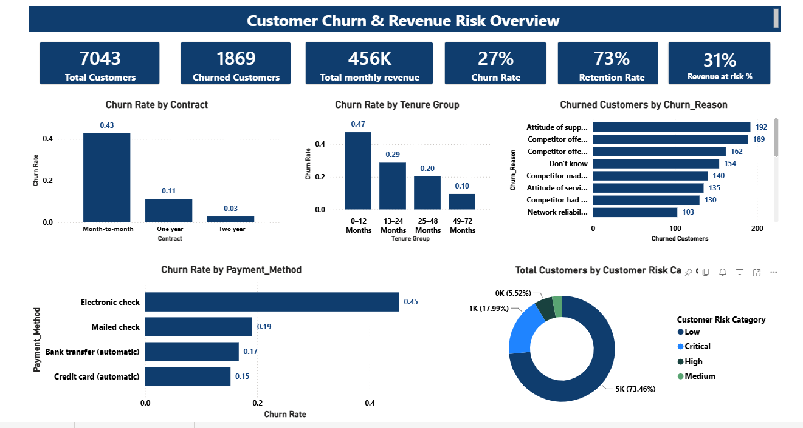

# Customer Churn & Revenue Risk Analysis Dashboard

Interactive Power BI dashboard analyzing customer churn patterns and quantifying revenue at risk for a subscription-style business.



## Business Problem
Subscription businesses lose revenue silently when at-risk customers churn without warning. This project identifies *who* is likely to churn, *why*, and *how much revenue* is at stake — so retention efforts can be targeted instead of blanket.

## Tools & Skills
`Power BI` `DAX` `Data Modeling` `Data Visualization` `Requirements Documentation (BRD)`

## Repository Structure
```
Customer_Churn_Revenue_Risk_Dashboard/
├── README.md
├── BRD.md                          
├── Data_Dictionary.md              
├── LICENSE
├── .gitignore
├── Customer_Churn_Revenue_Risk_Dashboard.pbix  
└──  executive_overview.png
```

## Dataset
Customer-level data including contract type, tenure, payment method, monthly/total charges, and churn status (7,043 customers). Full field definitions are in [`Data_Dictionary.md`](Data_Dictionary.md).

## Approach
1. **Requirements Definition** — Scoped the project via a formal BRD (see [`BRD.md`](BRD.md)) covering objectives, stakeholders, and functional requirements before building.
2. **Data Modeling** — Structured a normalized model across `Customer_Churn`, `Data_Dictionary`, and `Data_Quality` tables to support scalable, drill-through reporting.
3. **DAX Measures** — Built custom measures for Churn Rate, Retention Rate, and Revenue at Risk %.
4. **Segmentation** — Classified customers into 4 risk tiers (Low / Medium / High / Critical) based on tenure, contract type, and payment method.
5. **Root-cause analysis** — Broke down churn by contract type, tenure group, payment method, and stated churn reason to isolate the strongest predictors.

## Key Insights
- **27% overall churn rate**, with **31% of monthly revenue (₹456K)** flagged as at-risk, across 7,043 total customers (1,869 churned).
- **Month-to-month contracts** and **electronic check payments** are the strongest churn predictors.
- **Churn is heavily front-loaded by tenure** — customers in their first 0–12 months churn at nearly double the rate of customers in the 49–72 month bracket, meaning early-tenure retention matters most.
- **73% retention rate** overall, but retention drops sharply in the "Critical" risk tier.
- Top stated churn reasons include dissatisfaction with support attitude, competitor offers (device/price/service), and network reliability.

## Business Recommendation
Target retention offers specifically at high-risk, month-to-month, electronic-check customers in their first 12 months — this segment disproportionately drives the revenue-at-risk figure and is the most churn-prone by tenure.

## How to View
- Open `Customer_Churn_Revenue_Risk_Dashboard.pbix` in Power BI Desktop, or
- View the published report: https://app.powerbi.com/groups/me/reports/a6449637-c3ee-41f0-a8e6-330504a8f6f9/c44a766d746ed781888f?experience=power-bi

## Documentation
- [Business Requirements Document (BRD)](BRD.md)
- [Data Dictionary](Data_Dictionary.md)

---
**Author:** Saraswati Sarjerao Shinde | [LinkedIn](https://www.linkedin.com/in/saraswati-shinde/) | shindesara444@gmail.com
